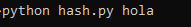
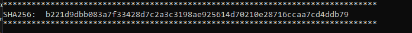

# sha256_text
Se convierte una palabra a sha256

## Antes de usar 

~~~~
pip install hashlib
~~~~

## Uso del Script

~~~~
python hash.py hola
~~~~

Sustituye hola, por la palabra que quieres convertir a sha256

## Ejemplo

Podemos comprobar con la siguiente web : <a href="https://codebeautify.org/sha256-hash-generator"> https://codebeautify.org/sha256-hash-generator<a/>

Si lo comparamos en la web nos sale:

b221d9dbb083a7f33428d7c2a3c3198ae925614d70210e28716ccaa7cd4ddb79
